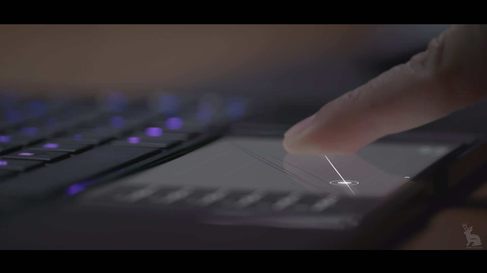

<iframe src="https://player.vimeo.com/video/252664844" width="960" height="540" frameborder="0" allow="autoplay; fullscreen" allowfullscreen></iframe>

I had the opportunity to work on Compositing and Rotoscoping for Project Linda, Razer's concept which merges the power of the Razer Phone with the comfort of a large screen and a physical keyboard. 

I was in charge of a couple of shots, to composite graphics that were created in house with the main footage. Also, I enhanced the shot by adding reflections to make it look more realistic and aesthetic.

In addition, I assisted in other shots by rotoscoping and matchmoving, providing tracking information and a clean plate for the main artist working on that shot to use.

Here are some stills of my composition from the advertisement:

