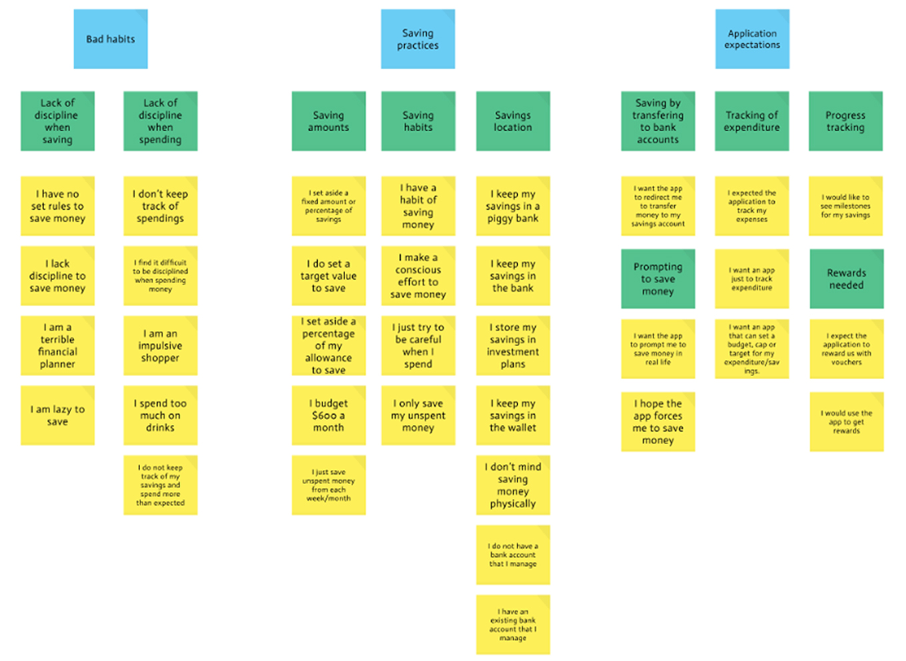

[Check out PetSaver](https://www.figma.com/proto/t4xCdlNXbTZZgaFvollWTr/Main-Screen?node-id=15%3A59&scaling=scale-down)

## Motivation to save money

Using cashless transactions is quite common that we lose track of how much we are spending and this could be a problem when we are trying to save money.

Financial literacy are not fromally taught to young adults and teenagers. They typically do not have much savings and lack the discipline to save on a consistent basis.

It is noted that there are existing saving or spending trackers such as Seedly that monitor the user's expenses. However, they do not cater to a younger audience as they lack the discipline to user the application on a consistent basis. 

## Approach

We came up with PetSaver, a mobile application that aid users in saving money through a gamified experience with the help of a virtual pet. 

PetSaver will prompt the user with the help of a virtual pet companion whose cuteness will motivate our target users to use PetSaver regularly and foster a good saving habit.
We aim to provide an ease of transition to save as user spend money in-game. Money is saved through completing recurrent tasks, which involve buying clothes, food or medicine for the pet. The more money the user spend on the pet, the more the money the user saves.

### Persona

Our Target user groups are Young adults (21~23 years old) and Teenagers (13~20 years old) 

Two personas presented edge cases since they are based on certain common needs of our target user groups.

Narrowing down to focus on a specific user helps to keep the user's needs in mind whenever there an idea for a new feature pop up.

### Storyboard

Jia Yi launches PetSaver and sign up for an account, set a target saving goal and created her virtual pet, Neko. The app prompts her to buy food for Neko as she is hungry. Jia Yi then bought food for Neko and fed the pet, and the progress bar of her target saving goal increases.

Brandon can accessorise his pet and compare his saving progress with his friends on the leaderboard which encourage him to save more.

### Affinity Diagram

https://www.youtube.com/watch?v=U7QycrOnMk4&feature=youtu.be
