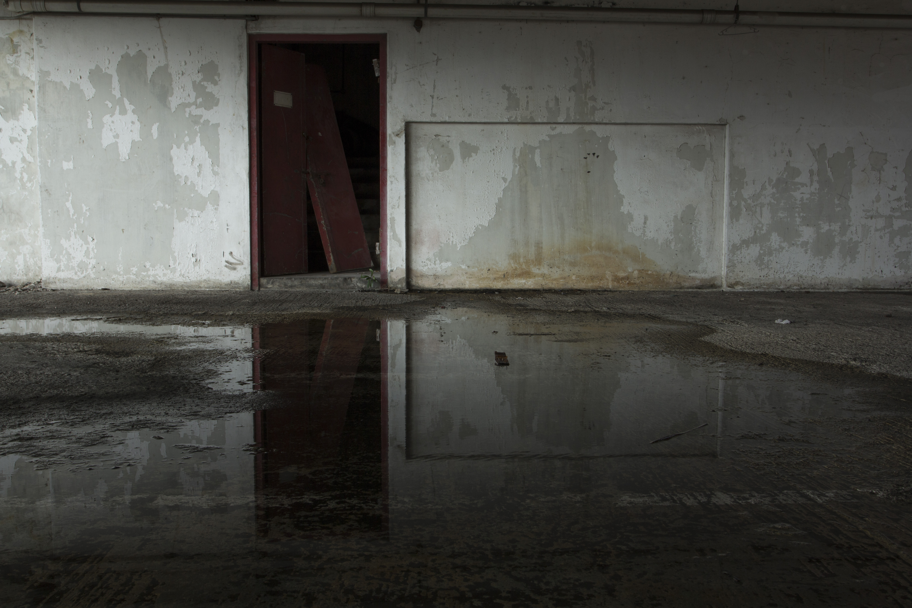
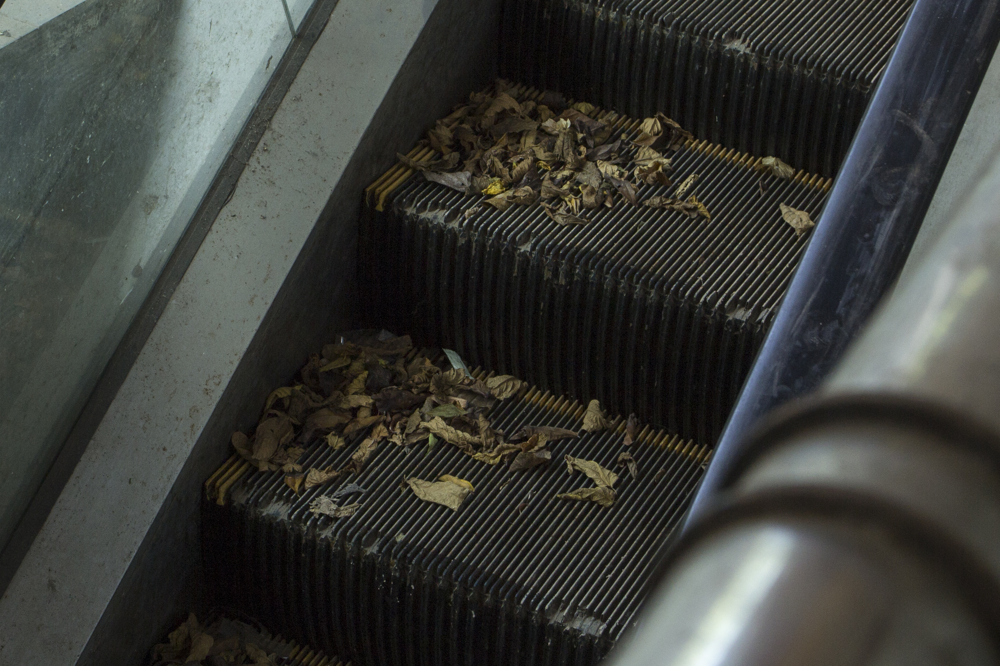
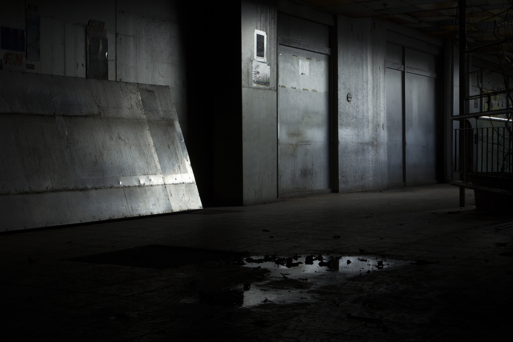

I decided to take photos of abandoned buildings as there is something both eerie and strikingly beautiful about these places, as if they're beauty left in the ruins. I heard that Pearl Centre was going to be demolished, so I quickly made a trip down. I explored the building, from bottom up and even managed to catch a movie in the Yangtze Cinema before it closes down.

[Click here to view the full album!](https://www.flickr.com/gp/152541985@N04/3x7NRu)

